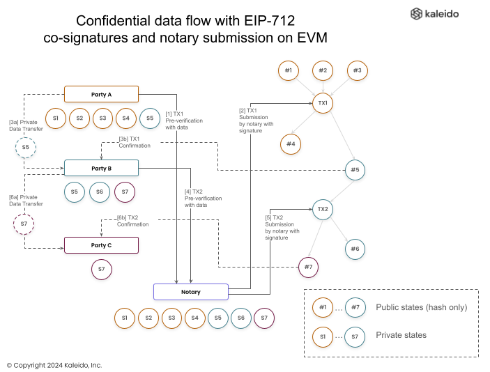

# Noto - Notarized Tokens

Privacy preserving token smart contract for fungible and non-fungible tokens, with transactions pre-verified by a notarizing entity.

Examples of potential notaries:

- The issuer of a tokenized cash asset, such as the bank issuing a tokenized deposit, or the central bank maintaining a wholesale CBDC
- The registrar of a tokenized security, such as the issuer or transfer-agent of a tokenized fund unit or bond certificate

In the notarized token model implemented by Noto, this notarizing entity:

1. Sees all transaction data, before the transaction is finalized
2. Verifies a signature from the transacting entity, that authorizes the transaction based on the disclosed data
3. Writes the transaction to the blockchain using the notary identity, including the verified signature

The base EVM ledger smart contract:
1. Performs double spend protection on UTXO states, which are made confidential through hashes
2. Requires the transaction to be submitted by the notary

This means:
- Any party can trust any token confirmed by the blockchain, and received privately, as long as they trust the notary to pre-verify all transactions
- Any party can check the working of the notary, on any transaction, using the signature recorded on-chain along with a copy of the private data

## Transaction walkthrough

Walking through a simple token transfer scenario, where Party A has some fungible tokens, transfers some to Party B, who then transfers some to Party C.

No information is leaked to Party C, that allows them to infer that Party A and Party B previously transacted.

1. `Party A` has three existing private states in their wallet and proposes to the notary:
    - Spend states `S1`, `S2` & `S3`
    - Create new state `S4` to retain some of the fungible value for themselves
    - Create new state `S5` to transfer some of the fungible value to `Party B`
2. `Notary` receives the signed proposal from `Party A`
    - Validates that the rules of the token ecosystem are fully adhered to
    - Example: `sum(S1,S2,S3) == sum(S4,S5)`
    - Example: `Party B` is authorized to receive funds
    - Example: The total balance of `Party A` will be above a threshold after the transaction
    - Uses the notary account to submit `TX1` to the blockchain recording signature + hashes
3. `Party B` processes the two parts of the transaction
    - a) Receives the private data for `#5` to allow it to store `S5` in its wallet
    - b) Receives the confirmation from the blockchain that `TX1` created `#5`
    - Now `Party B` has `S5` confirmed in its wallet and ready to spend
4. `Party B` proposes to the notary:
    - Spend state `S5`
    - Create new state `S6` to retain some of the fungible value for themselves
    - Create new state `S7` to transfer some of the fungible value to `Party C`
5. `Notary` receives the signed proposal from `Party B`
    - Validates that the rules of the token ecosystem are fully adhered to
    - Uses the notary account to submit `TX2` to the blockchain recording signature + hashes
3. `Party C` processes the two parts of the transaction
    - a) Receives the private data for `#7` to allow it to store `S7` in its wallet
    - b) Receives the confirmation from the blockchain that `TX2` created `#7`
    - Now `Party C` has `S7` confirmed in its wallet and ready to spend

> TODO: Fill in significantly more detail on how Noto operates (Lead: Andrew Richardson)